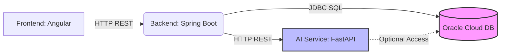

# ChurnInsight: Predicción Inteligente de Abandono para Pymes Fintech

**ChurnInsight** es una plataforma avanzada que utiliza Inteligencia Artificial y análisis financiero para predecir proactivamente el riesgo de abandono (churn) de clientes Pymes en el sector Fintech. Diseñado para optimizar las estrategias de retención y maximizar el valor del cliente.

---

## 🎯 El Problema: El Costo del Abandono en Fintech

En el dinámico sector Fintech, la **retención de clientes Pymes** es crítica. Las altas tasas de abandono no solo representan una pérdida directa de ingresos, sino que también implican un costo mayor en la adquisición de nuevos clientes. Las empresas necesitan identificar de antemano qué Pymes están en riesgo de abandonar la plataforma para poder implementar acciones de retención efectivas y rentables.

*   **Impacto Financiero:** Pérdida directa de ingresos recurrentes y aumento de costos de adquisición.
*   **Desafío Operativo:** Dificultad para predecir el comportamiento del cliente y asignar recursos de retención de manera eficiente.
*   **Oportunidad:** Empresas que implementan estrategias de retención basadas en datos pueden reducir significativamente sus tasas de abandono y mejorar la lealtad del cliente.

---

## 💡 Nuestra Solución: ChurnInsight

ChurnInsight proporciona una **solución integral y basada en datos** para predecir y mitigar el abandono de clientes. A través de un análisis inteligente de variables financieras y de comportamiento, ChurnInsight:

*   **Predice la probabilidad de abandono** para cada Pyme cliente.
*   **Identifica las "Red Flags"** críticas que indican un riesgo inminente.
*   **Genera recomendaciones personalizadas** para acciones de retención.
*   **Ofrece reportes claros y ejecutivos** que facilitan la toma de decisiones estratégicas.

Construido con tecnologías de vanguardia, ChurnInsight actúa como un **sistema de alerta temprana y un motor de inteligencia de negocio**, permitiendo a las empresas Fintech enfocarse en retener a sus clientes más valiosos.

---

## ⚙️ Arquitectura del Sistema

ChurnInsight se compone de tres servicios principales interconectados, respaldados por una base de datos robusta:

*   **Frontend (Angular):** La interfaz de usuario intuitiva donde los analistas y gerentes visualizan las predicciones, red flags y generan reportes.
*   **Backend (Spring Boot):** Orquesta la lógica de negocio, gestiona las interacciones con la base de datos y se comunica con el AI Service para obtener predicciones.
*   **AI Service (FastAPI):** El motor de predicción que utiliza modelos de Machine Learning y análisis heurístico para calcular el riesgo de churn y generar alertas.
*   **Oracle Database:** Almacena los datos de las empresas, métricas financieras, predicciones y otra información relevante.

**Para una comprensión detallada de la arquitectura, consulte:**
[docs/01_Project_Overview.md](https://github.com/H12-25-L-Equipo-70/ChurnInsight/blob/main/docs/01_Project_Overview.md) y [docs/06_Backend_Architecture.md](https://github.com/H12-25-L-Equipo-70/ChurnInsight/blob/main/docs/06_Backend_Architecture.md)

---

## 🚀 Componentes Clave

### 🤖 AI Service (FastAPI)
El cerebro analítico de ChurnInsight. Se encarga de:
*   **Modelado Predictivo:** Implementa modelos de Machine Learning y análisis heurístico (basado en datos financieros y de comportamiento) para predecir la probabilidad de churn.
*   **Generación de Red Flags:** Identifica y clasifica hasta 14 tipos de señales de alerta (ej. baja actividad, endeudamiento, historial crediticio) según su severidad.
*   **Procesamiento Batch:** Permite realizar predicciones masivas sobre grandes volúmenes de datos.
*   **API de Predicción:** Expone endpoints REST para recibir datos de empresas y devolver predicciones, probabilidades y alertas.

*   **Tecnologías:** Python, FastAPI, Pydantic, Scikit-learn, Pandas.
*   **Documentación Detallada:** [AI Service Quick Start](https://github.com/H12-25-L-Equipo-70/ChurnInsight/blob/main/docs/02_AI_Service_Quick_Start.md) y [docs/04_AI_Service_API.md](https://github.com/H12-25-L-Equipo-70/ChurnInsight/blob/main/docs/04_AI_Service_API.md)

### ⚙️ Backend Service (Spring Boot)
El orquestador de ChurnInsight. Sus funciones incluyen:
*   **Orquestación y Lógica de Negocio:** Gestiona el flujo de datos entre el Frontend, la Base de Datos y el AI Service.
*   **Persistencia de Datos:** Se comunica con Oracle Database para almacenar y recuperar información de clientes, métricas y predicciones.
*   **Exposición de API:** Proporciona endpoints REST para que el Frontend acceda a datos y funcionalidades.
*   **Gestión de Seguridad:** Implementa mecanismos de seguridad robustos, incluyendo el uso de Oracle Wallet para credenciales.

*   **Tecnologías:** Java, Spring Boot 3.x, JPA, Oracle Database.
*   **Documentación Detallada:** [Backend Quick Start](https://github.com/H12-25-L-Equipo-70/ChurnInsight/blob/main/docs/03_Backend_Quick_Start.md) y [docs/06_Backend_Architecture.md](https://github.com/H12-25-L-Equipo-70/ChurnInsight/blob/main/docs/06_Backend_Architecture.md)

### 🖥️ Frontend (Angular)
La interfaz de usuario que permite la interacción:
*   **Dashboard Interactivo:** Visualiza el estado de riesgo de las Pymes, alertas y métricas clave.
*   **Formulario de Entrada:** Permite ingresar o consultar datos detallados de las empresas para predicción individual.
*   **Visualización de Resultados:** Muestra la probabilidad de churn, red flags contextualizadas, recomendaciones y reportes.
*   **Integración con Backend:** Consume los endpoints del Backend para obtener y enviar datos.

*   **Tecnologías:** Angular 21, Tailwind CSS, jsPDF.
*   **Documentación Detallada:** [docs/09_Frontend_Integration_Guide.md](https://github.com/H12-25-L-Equipo-70/ChurnInsight/blob/main/docs/09_Frontend_Integration_Guide.md)

---

## 📊 Cómo Funciona la Predicción (Simplificado)

ChurnInsight se basa en un modelo analítico que evalúa una combinación de factores críticos de cada Pyme:

1.  **Indicadores Financieros:** Rentabilidad (margen operativo), endeudamiento (ratio deuda/activos).
2.  **Comportamiento Crediticio:** Historial de préstamos solicitados, aprobados y cancelados.
3.  **Patrones de Uso:** Nivel de actividad en la plataforma, número de transacciones, días de inactividad.

Estos indicadores se procesan para calcular una **puntuación de riesgo** y generar alertas específicas, indicando no solo la probabilidad de abandono, sino también las razones subyacentes.

**Para detalles técnicos sobre el modelo y las variables de entrada, consulte:**
[docs/01_Project_Overview.md](https://github.com/H12-25-L-Equipo-70/ChurnInsight/blob/main/docs/01_Project_Overview.md) y [docs/04_AI_Service_API.md](https://github.com/H12-25-L-Equipo-70/ChurnInsight/blob/main/docs/04_AI_Service_API.md)

---

## 🚀 Despliegue y Operaciones

### Objetivo de Despliegue: Oracle Cloud Infrastructure (OCI)
El objetivo final es desplegar ChurnInsight en una instancia de Oracle Cloud Infrastructure, utilizando Docker para la contenerización y orquestación de los servicios. Esto garantizará escalabilidad, robustez y un entorno de producción seguro.

La documentación detallada para el despliegue en OCI se encuentra en:
[docs/05_Deployment_and_Commands.md](https://github.com/H12-25-L-Equipo-70/ChurnInsight/blob/main/docs/05_Deployment_and_Commands.md)

---

## ⚡ Inicio Rápido (Desarrollo Local)

Para configurar y ejecutar ChurnInsight localmente, consulte la guía detallada:
[docs/00_Quick_Start.md](https://github.com/H12-25-L-Equipo-70/ChurnInsight/blob/main/docs/00_Quick_Start.md)

Esta guía cubre los requisitos previos, configuración del entorno y las diferentes opciones para iniciar los servicios (Docker Compose o ejecución nativa).

---

## 📖 Documentación Técnica Detallada

Acceda a la documentación completa de ChurnInsight a través de los siguientes enlaces:

| Documento                                    | Descripción                                                                                                |
| :------------------------------------------- | :--------------------------------------------------------------------------------------------------------- |
| [Project Overview](https://github.com/H12-25-L-Equipo-70/ChurnInsight/blob/main/docs/01_Project_Overview.md) | Visión general del proyecto, sus objetivos y la arquitectura general.                                        |
| [AI Service Quick Start](https://github.com/H12-25-L-Equipo-70/ChurnInsight/blob/main/docs/02_AI_Service_Quick_Start.md) | Guía rápida para configurar y ejecutar el servicio de IA.                                                  |
| [Backend Quick Start](https://github.com/H12-25-L-Equipo-70/ChurnInsight/blob/main/docs/03_Backend_Quick_Start.md)   | Guía rápida para configurar y ejecutar el servicio de Backend.                                             |
| [AI Service API Reference](https://github.com/H12-25-L-Equipo-70/ChurnInsight/blob/main/docs/04_AI_Service_API.md)     | Documentación detallada de los endpoints del AI Service, incluyendo esquemas de solicitud y respuesta.      |
| [Deployment and Commands Guide](https://github.com/H12-25-L-Equipo-70/ChurnInsight/blob/main/docs/05_Deployment_and_Commands.md) | Instrucciones para el despliegue en OCI y comandos de gestión.                                              |
| [Backend Architecture](https://github.com/H12-25-L-Equipo-70/ChurnInsight/blob/main/docs/06_Backend_Architecture.md) | Descripción detallada de la arquitectura del Backend, patrones de diseño y tecnologías empleadas.         |
| [New Notebook Integration](https://github.com/H12-25-L-Equipo-70/ChurnInsight/blob/main/docs/07_Integration_NewNotebook.md) | Guía específica sobre la integración de nuevos modelos o notebooks de Data Science en el AI Service.        |
| [Comprehensive Local Testing](https://github.com/H12-25-L-Equipo-70/ChurnInsight/blob/main/docs/08_Testing_Local_Complete.md) | Guía exhaustiva para la ejecución de pruebas unitarias, de integración y de extremo a extremo localmente. |
| [Frontend Integration Guide](https://github.com/H12-25-L-Equipo-70/ChurnInsight/blob/main/docs/09_Frontend_Integration_Guide.md) | Explica la integración del Frontend Angular con el Backend y el AI Service.                               |
| [Docker Guide](https://github.com/H12-25-L-Equipo-70/ChurnInsight/blob/main/docs/DOCKER_GUIDE.md)             | Guía detallada sobre el uso de Docker y Docker Compose para gestionar los servicios de ChurnInsight.        |
| [Quick Start Guide](https://github.com/H12-25-L-Equipo-70/ChurnInsight/blob/main/docs/00_Quick_Start.md)       | Guía rápida para configurar y ejecutar ChurnInsight localmente (Docker y nativo).                           |

---

## 🤝 Contribuciones

Invitamos a la comunidad a contribuir con mejoras y nuevas funcionalidades.
1.  Haga un "fork" del repositorio.
2.  Cree una nueva rama para sus cambios (`git checkout -b feature/su-feature`).
3.  Realice sus modificaciones y haga "commit" (`git commit -m 'Add some feature'`).
4.  Envíe sus cambios a la rama (`git push origin feature/su-feature`).
5.  Abra un "Pull Request" para que podamos revisar sus contribuciones.

---

## 📝 Licencia

Este proyecto está licenciado bajo la Licencia Pymer - ChurnInsight Project.

---

## 👥 Equipo

Desarrollado como parte del **Hackathon Team 70**.

*   **Frontend:** Angular 21 + Tailwind CSS
*   **Backend:** Java Spring Boot 3.x + Oracle DB
*   **AI Service:** Python FastAPI + ML Model
*   **Orquestación:** Docker & Docker Compose

---

## 📞 Soporte y Comunidad

Para obtener ayuda o discutir el proyecto:
*   **Documentación Completa:** Diríjase a la carpeta `docs/`.
*   **Reporte de Problemas:** Abra un "Issue" en el repositorio de GitHub.
*   **Preguntas Técnicas:** Consulte la documentación detallada o cree un "Issue" para discutir.

---

## 🎯 Roadmap de Desarrollo

*   ✅ **v1.0.0:** Core functionality, AI Service & Backend Integration, Local Docker Setup.
*   🔲 **v1.1.0:** Frontend Angular Dashboard & Reporting Integration.
*   🔲 **v1.2.0:** Deployment Strategy for Oracle Cloud Infrastructure (OCI).
*   🔲 **v1.3.0:** Advanced Monitoring & Logging setup.
*   🔲 **v2.0.0:** CI/CD pipeline automation.

---

**Última Actualización:** 24 de Enero, 2026
**Versión:** 1.1.0 - Frontend Integrado ✅ | Backend Integrado ✅ | AI Service Operacional ✅
